# Fresh-eyes product analysis, 2026-10-09

Reviewed `main` at `76b45eaba484a8133e8e9f907e8cb342715464a4`. On 2026-10-09 the live page https://jakeand3rson.github.io/city-day-test/ served an `index.html` whose SHA-256 matched that commit (`962063767acddb012aec8f3fc2baca5950ce543b1e8b0673920e804938ffc458`). No difference between the live HTML and `main`.

The charter file `docs/reviews/2026-10-direction.md` is not in this repo. Gaps below use the seven product rules in `CLAUDE.md` and the guardrails in `docs/SDLC.md`. Charter-only questions are marked as such.

**Question for PM:** Claude Fable is not in this session's model list. The issue says to ask before substituting. This doc does not include a Fable section and does not rename another Claude model as Fable.

Options:
1. Accept the three sections below (Claude Opus 5.5, GPT-5.6 Terra, Gemini 3.8 Flash) as this review, and add a Fable section later if the model appears.
2. Hold this PR until Fable is in the picker, then add that section on the same branch.
3. Name a substitute and label it as a substitute in the doc.

Recommendation: option 1. The three sections were written independently, and the weekend read can use them. A Fable section can be a follow-up commit if you want that model by name.

Gemini 3.1 Pro, named in an older setup note, is also absent. The Gemini section uses Gemini 3.8 Flash and says so.

## How the sections stayed independent

Three analysts ran at the same time, each with the same brief: the `main` SHA, the live-HTML hash, the seven product rules, the walk log, and the screenshots. None of them received another analyst's writing. The Engineering Manager wrote the synthesis after reading all three.

| Section | Model | Cursor slug |
|---|---|---|
| Missing, pending the question above | Claude Fable | not in this session's model list |
| Below | Claude Opus 5.5 (high) | `claude-opus-5-5-high` |
| Below | GPT-5.6 Terra (high) | `gpt-5.6-terra-high` |
| Below | Gemini 3.8 Flash (high) | `gemini-3.8-flash-high` |

## Core flow at 390×844

Walked on the live site in Chromium, viewport 390×844, on 2026-10-09. Made-up names Alex and Riley. Occasion Date, kind easy, date 2026-10-10, drinking No, lean Must-sees, budget $80, note "easy walking, coffee in the morning, tacos, no museums". The share link was opened in a fresh browser context. No page errors. No sideways scroll.

The National Weather Service text on the curtain and on Plan B was: Saturday, 88°F, wind 17 mph SSE, Scattered Showers And Thunderstorms.

### Creator

About screen, then the brief, then the desk and the share link.

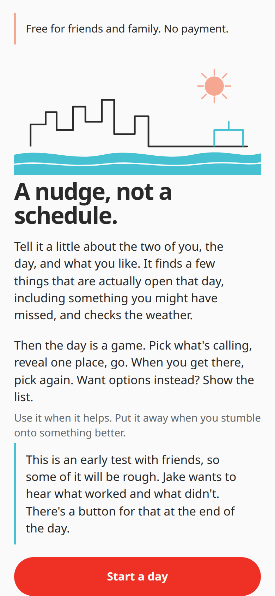

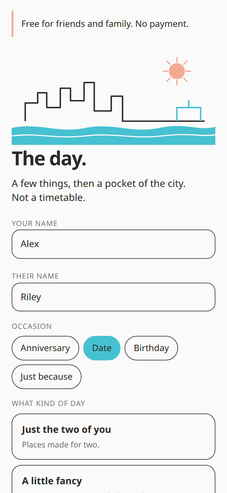

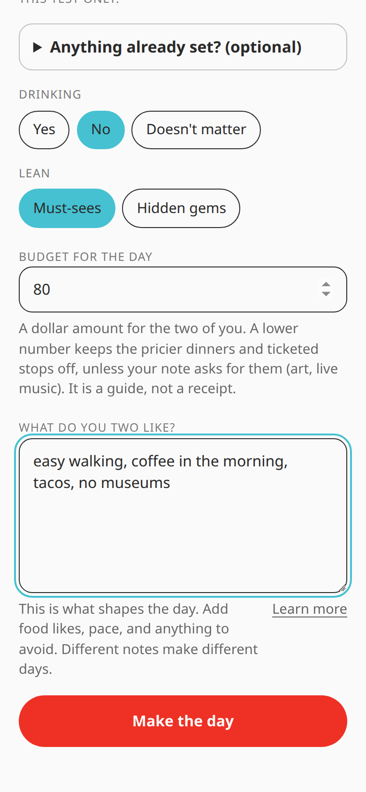

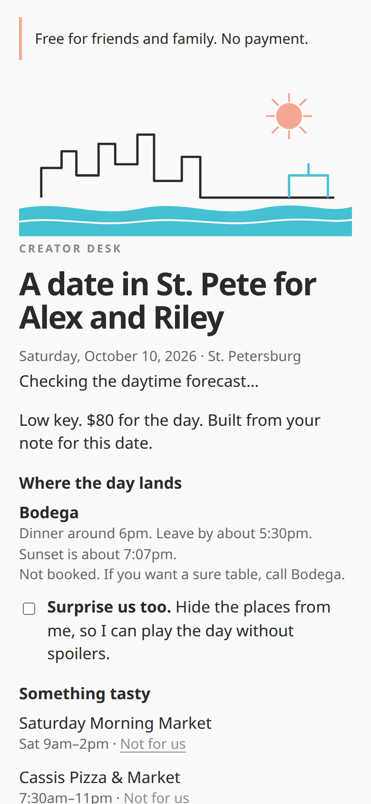

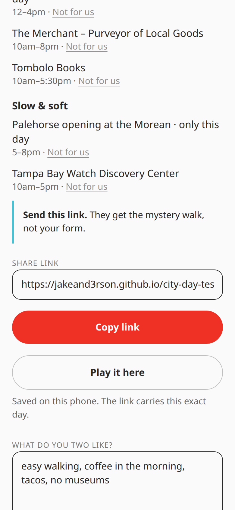

### Recipient

Curtain, feeling, commit, reveal, "Not this", "We're here", the list, "Sky looks iffy", and the trail.

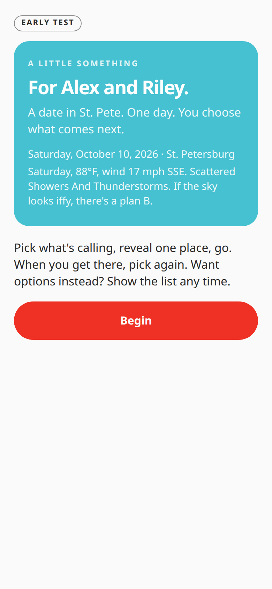

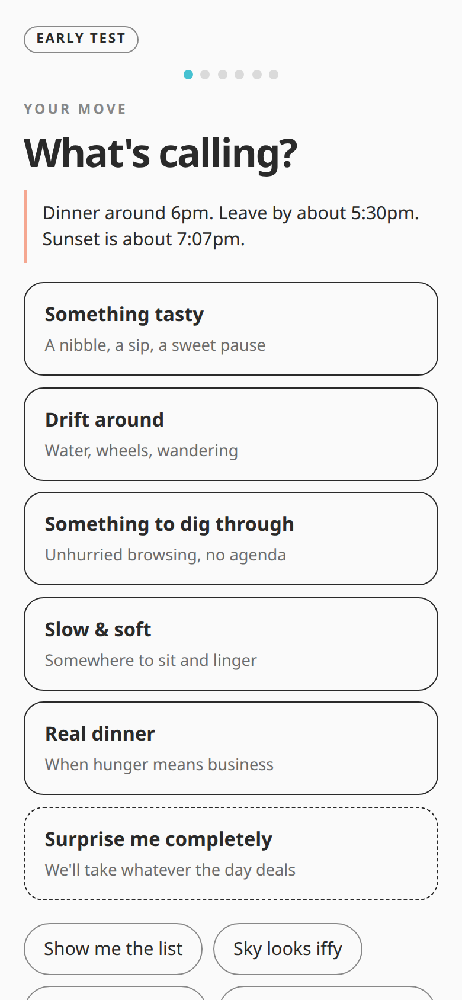

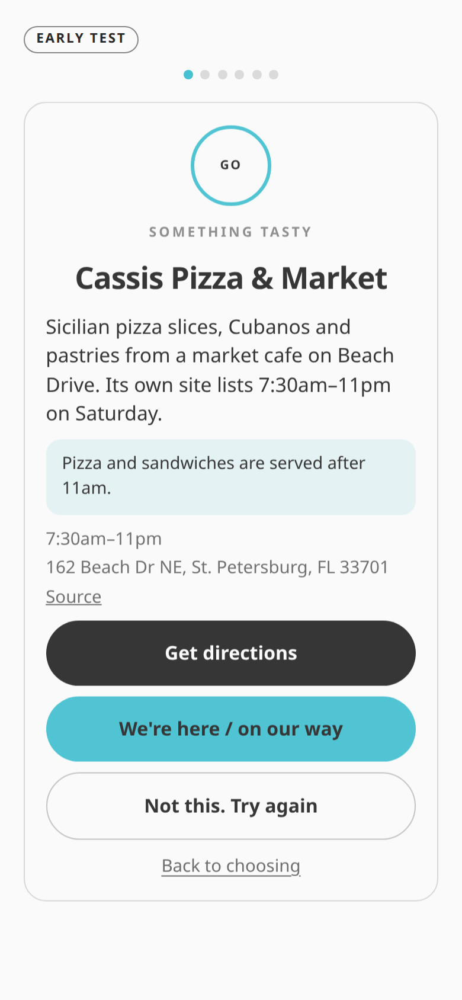

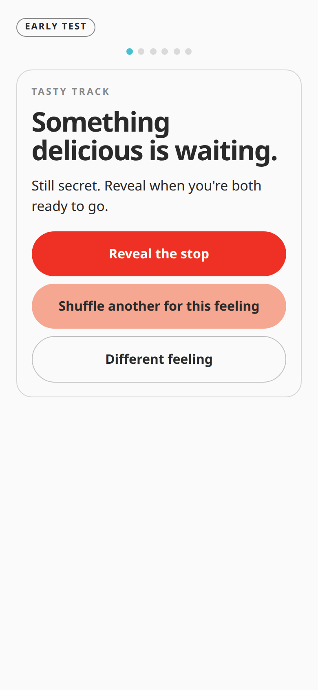

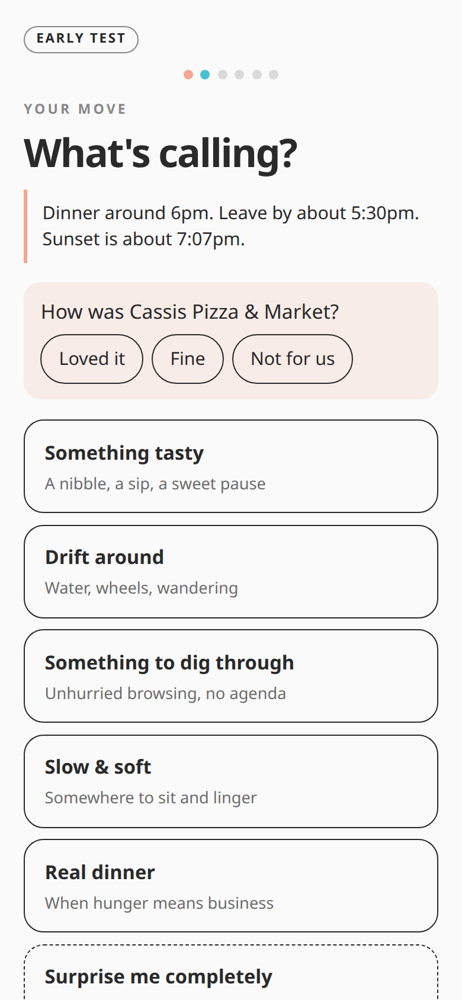

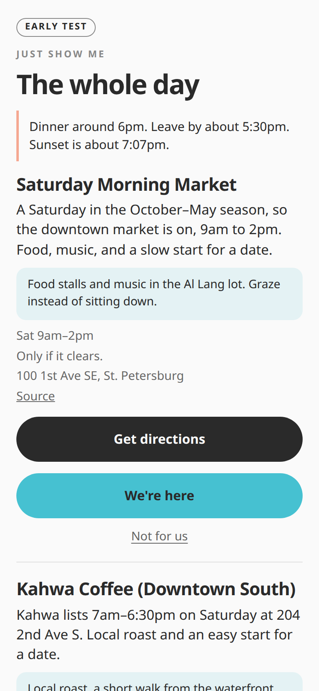

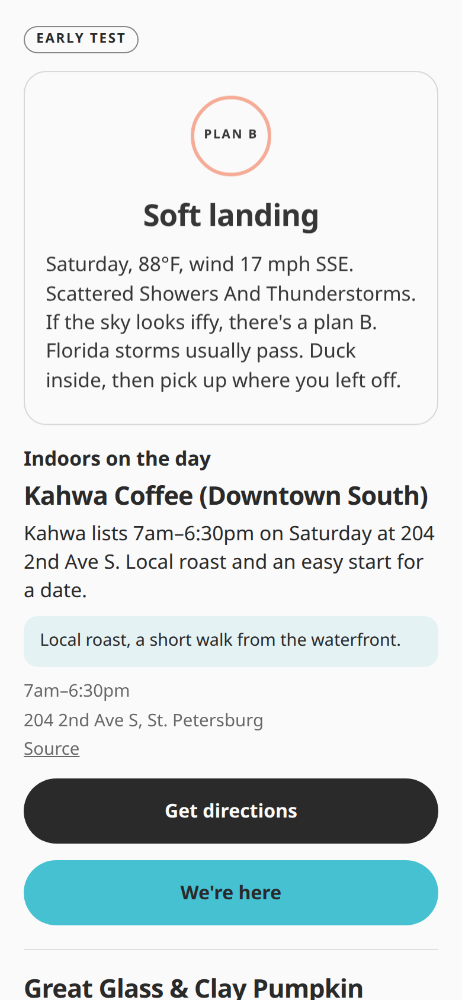

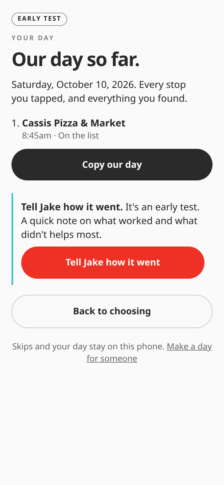

What the walk showed, as facts for the sections below:

- Reveal named Cassis Pizza & Market, with Saturday hours 7:30am–11pm, the sandwich caveat, the address, Source, Directions, "We're here / on our way", "Not this. Try again", and "Back to choosing".
- "Not this" returned to the veiled commit card (Reveal, Shuffle, Different feeling). It did not show the next place.
- "We're here" returned to the feeling screen and asked how Cassis was. The strip said dinner around 6pm, leave by about 5:30pm, sunset about 7:07pm. "Real dinner" was one of the feelings.
- The list was titled "The whole day". Saturday Morning Market showed Sat 9am–2pm and "Only if it clears."
- Plan B listed Kahwa Coffee under indoors and included the forecast sentence above, plus "Florida storms usually pass."
- The trail, after "We're here", listed Cassis at 8:45am as "On the list". Before that tap the trail was empty. 8:45am was the clock on the review machine (Eastern) on Friday, for a Saturday plan.

A later read of `index.html` on this commit confirms `markHere` records the tap without checking `isPlanDay()`, and `skipHere` returns to the commit card. `anchorOffered` checks whether dinner is too late to close, and it does not check whether the restaurant has opened yet.

## Independent sections

## Claude Opus 5.5 (high)

Cursor model slug: `claude-opus-5-5-high`. Reviewed `origin/main` at `76b45ea` (the live `index.html` is byte-identical). Sources: the shared walk log, screenshots `01-about.png` through `14-trail.png`, a full read of `index.html`, and the docs on `main` (`CLAUDE.md`, `CONTRIBUTING.md`, `docs/SDLC.md`, `README.md`). I also ran two short Playwright scripts against `main`'s `index.html`, served locally at 390×844. They used the same brief (Alex and Riley, Date, Low key, Saturday 2026-10-10, no drinking, Must-sees, $80, the same note). The VM clock was Friday 2026-10-09, and for the day-of checks I overrode the page clock to Saturday morning. Those runs are marked "my repro" below. I could not read the charter, so nothing here cites it.

### What works

- **The pitch is clear before anyone types.** The about screen says it's a nudge, not a schedule, explains the loop in two sentences, and says up front that it's an early test with a feedback button at the end (`01-about.png`).
- **The loop matches the product rules.** It goes feel, then a veiled commit card, then one revealed place, then "We're here," then pick again. The list, "Sky looks iffy," "Vibes are cooling," "We found something," and "Our day so far" are secondary pill buttons below the feelings (`07-feel.png`, `08-commit.png`, `09-reveal.png`).
- **The reveal card shows its evidence.** For Cassis Pizza & Market it gave the hours ("Its own site lists 7:30am–11pm on Saturday"), the useful caveat "Pizza and sandwiches are served after 11am," the address, a Source link, and Directions. That is the right posture for "never invent hours."
- **The weather is real or plainly absent.** The curtain and Plan B show the NWS text as delivered (Saturday, 88°F, wind 17 mph SSE, Scattered Showers And Thunderstorms). The code has honest fallbacks: "The forecast didn't load. No weather was invented." and "The forecast isn't out yet for this date." Outdoor cards get "Only if it clears." when the forecast is wet (the Saturday Morning Market card in `12-list.png`).
- **The note shapes the day the way the brief asked:**
  - "no museums" removed the Dalí and the MFA. Both are tagged `museum`, and `noteAvoids` vetoes both on a generic "museum."
  - "tacos" pulled Bodega in as the dinner.
  - "coffee in the morning" put Kahwa and Cassis in the tasty pool. Kahwa also lists coffee, café, and breakfast tags.
  - Drinking "No" kept Green Bench Brewing out. The code also keeps it out for "Doesn't matter" (`effectiveDrink(p) !== "yes"`), so alcohol is opt-in, as product rule 7 requires.
- **The link carries a frozen deck, not the brief.** `linkPlan()` sends the names, occasion, kind, date, drink, lean, anchor, and deck. It leaves out the note, budget, and vetoes. `cleanDeck()` drops unknown place IDs, so an old link with a removed place still opens. `qa-verify.mjs` has an `OLD_LINKS` regression set.
- **There's no tracking.** The only network calls are `api.weather.gov` and Google Maps links the user taps. Feedback goes through the phone's share sheet or the clipboard, and no contact details are in the code.
- **The phone layout holds up.** There's no horizontal overflow at 390×844, the main buttons are large, and the escape pills set `min-height: 44px`.

### What's confusing

- **"Not this. Try again" doesn't try again on screen.** It quietly picks a different place and drops you back on the same veiled card ("Something delicious is waiting." with Reveal the stop, Shuffle, Different feeling). Nothing says a new place was picked (`10-not-this.png` is pixel-for-pixel the same layout as `08-commit.png`). The skip is also permanent for the day on that phone, and there's no undo. My repro confirmed the skip survives a reload.
- **"We're here / on our way" is one button for two different moments.** Right after it, the feel screen asks "How was Cassis Pizza & Market?" with Loved it / Fine / Not for us (`11-were-here.png`). A couple who tapped it because they're on their way get asked to rate a place they haven't reached.
- **The trail labels a revealed stop "On the list."** Cassis was revealed through the mystery, but the trail says "8:45am · On the list" (`14-trail.png`). In this app "the list" means the "Show me the list" escape. The code labels every non-"found" entry "On the list" (`trailHtml`).
- **"Real dinner" is offered from the first screen of the morning.** The strip says "Dinner around 6pm. Leave by about 5:30pm." The "Real dinner" button sits next to the daytime feelings at breakfast time (`07-feel.png`). See the dinner bug below for what that leads to.
- **"Surprise us too" comes after the spoilers.** On the creator desk, the dinner name ("Bodega") and the first places in each feeling (Saturday Morning Market, Cassis…) are already on screen above or right below the checkbox that hides them (`04-desk.png`).
- **"No museums" still leaves a museum-like Slow & soft pool.** Its only two picks were "Palehorse opening at the Morean" (a gallery opening) and Tampa Bay Watch Discovery Center (an exhibit gallery with a touch tank, by its own blurb). Alex and Riley may read both as museums. The engine only vetoes places tagged `museum`.
- **"Easy walking" doesn't keep the day compact.**
  - Cassis (162 Beach Dr NE) and Kahwa (204 2nd Ave S) are downtown.
  - The deck also includes Tombolo Books (2153 1st Ave S), and the dinner is Bodega (1180 Central Ave).
  - The code says outright that there's no travel model: `WALK = 0.25` is a flat 15 minutes for every trip.
  - Nothing on the cards tells the couple which stops are far apart.
- **The weather text is shown in NWS capitalization.** "Scattered Showers And Thunderstorms" (title case, "And" capitalized) appears on the curtain and on Plan B (`06-curtain.png`, `13-iffy.png`). It's a small thing, but it reads like raw data, not the app's own voice.
- **Plan B's indoor list includes places whose indoor status isn't known.** "Indoors on the day" lists Kahwa, then Great Glass & Clay Pumpkin Patch (`13-iffy.png`). The code counts any stop without an `outdoor: true` flag as indoors. My repro shows the deck's "indoor" set includes the pumpkin patch and the Palehorse opening. Nothing in the catalog says whether the pumpkin patch is inside.

### Bugs

1. **Playing before the date writes into the real day.** A "We're here" tapped the day before lands on Saturday's trail with Friday's clock time. That stop is then gone from Saturday's deck, Saturday morning opens by asking how it was, and the time goes into the feedback message to Jake.
   - **What happened:** The walk was run on Friday 2026-10-09 for a Saturday 2026-10-10 day. The trail shows "Saturday, October 10, 2026 … Cassis Pizza & Market, 8:45am" (`14-trail.png`), but 8:45am was Friday morning Eastern.
   - **My repro:** A day-early "We're here" on the Saturday Morning Market made `offered("taste")` on Saturday at 9am leave the market out. A day-early "We're here" on Cassis made the Saturday 8:30am feel screen open with "How was Cassis Pizza & Market?". The text sent to Jake read "Saturday, October 10, 2026 … - 8:49am Cassis Pizza & Market."
   - **Cause:** `markHere()` and `skipHere()` never check `isPlanDay()`. Off the plan date, `openNow()` returns true for everything ("Off the plan's date, everything stays on offer"). Play state is keyed only by `plan.id`.
   - **Repro steps:**
     1. Create a day for tomorrow.
     2. Copy the link and open it in a fresh browser today.
     3. Tap Begin, then Something tasty, then Reveal the stop, then "We're here / on our way."
     4. Open "Our day so far." Today's time is listed under tomorrow's date.
     5. Open the same link tomorrow. The stop is gone from its feeling, and the feel screen asks how it was.
     6. Doing "Not this" day-early removes that place from the real day the same way.

2. **"Real dinner" can end the day at breakfast.**
   - **What happened (my repro):** With the page clock set to Saturday 2026-10-10 at 9:00am, the feel screen offered "Real dinner." Its reveal showed Bodega ("Bodega's site lists 11am–11pm today"), which wasn't open yet, with no "opens at 11am" or "come back at 6" warning in the closing strip. Tapping "We're here / on our way" switched the strip to "Dinner: done. Sunset is about 7:07pm." It also showed the wind-down "How did it go? … Tell Jake how it went" box. One curious tap at 9am closes out the day's fixed point.
   - **Cause:** `anchorOffered()` checks only `anchorDone()` and `anchorLate()`, never the dinner spot's opening time. `markHere("bodega")` marks the anchor done, and `feelHtml` treats that as "wound."
   - **Repro steps:**
     1. Use the brief above, so Bodega is the dinner.
     2. Open the link on the day before 11am.
     3. Tap Begin, then Real dinner, then Reveal the stop, then "We're here / on our way."

3. **"Not this. Try again" doesn't do what its label says.**
   - **What happened:** After Not this on Cassis, the screen went back to the veiled commit card, not a new reveal (`10-not-this.png`). My repro confirmed `view.panel === "commit"` after the tap. The skip was in `playState().skip` after a reload, with no way to bring Cassis back from the play screens.
   - **Cause:** `skipHere()` sets a new pending place and calls `go("commit")`.
   - **Repro steps:** Tap Begin, then Something tasty, then Reveal the stop, then "Not this. Try again." You land on "Something delicious is waiting." and need a second tap to see anything.
   - **Classification:** If the re-veil is intended, this is a copy bug ("Try again" promises another place). Either way there's no undo.

4. **"Surprise us too" can't prevent the spoiler it promises to hide.**
   - **What happened:** On the creator desk, "Where the day lands: Bodega … call Bodega" renders above the "Surprise us too" checkbox, and the first places in each feeling render right below it. My repro found "Bodega" at text offset 214 and "Surprise us too" at 341 in `#desk-top`. A creator who wants to play their own day blind has already seen the dinner and the first stops (`04-desk.png`).
   - **Repro steps:** Fill in the brief and tap Make the day. Read the desk from the top.

5. **The trail mislabels revealed stops as "On the list."**
   - **What happened:** Cassis was tapped "We're here" from the mystery reveal, and the trail shows "On the list" (`14-trail.png`).
   - **Repro steps:**
     1. Tap Begin, then a feeling, then Reveal the stop, then "We're here / on our way."
     2. Open "Our day so far."
   - **Cause:** `t.found ? "Found it ourselves" : "On the list"`.

6. **The cosmetic issue: raw NWS title case in weather copy.**
   - **What happened:** The weather line reads "Scattered Showers And Thunderstorms" (`06-curtain.png`, `13-iffy.png`).
   - **Repro steps:** Open any day whose NWS `shortForecast` has more than one word.
   - **Cause:** `w.short` is printed as-is.

### Gaps against the docs that are actually in the repo

- **Product rule 2: "Every stop is verified open for the day it's planned for."** It's met for opening hours in general, but with these holes:
  - Bug 2 sends people to a dinner spot hours before it opens.
  - The older hard-coded `STOPS` entries (Kahwa, Bodega, Stillwaters, BellaBrava, Paciugo, the Pier, Green Bench, the Morean, ARTpool) have no `hoursChecked` date. Most of them have `isOpen: function () { return true; }`, so no holiday or one-off closures. The newer `PLACES` entries all carry `hoursChecked: "2026-10-08"`.
  - The Saturday Morning Market is "open" by a season rule (any Saturday, October through May), with no list of skipped Saturdays. The card states it as fact: "A Saturday in the October–May season, so the downtown market is on."
  - Cassis's own `hoursText` ends "Hours are subject to change, please call to confirm hours as needed." The reveal doesn't pass that on.
- **Product rule 1: "Never invent … weather … or vibes."**
  - Plan B adds "Florida storms usually pass. Duck inside, then pick up where you left off." to the real forecast. That's a general weather claim, not from the forecast.
  - "Indoors" is assumed for every stop without an `outdoor` flag. Plan B and the desk count ("N indoor picks are on the day") rest on that assumption, not on a source (the pumpkin patch is one example).
- **Product rule 3: mystery first.** The structure holds. The list stays an escape, and it only gets louder after three stops or 3pm (`listPromoted`). But Bug 1 means a day-early peek counts as real "We're here" check-ins. Neither `CLAUDE.md` nor `docs/SDLC.md` says what a link should do before its date. Whether day-early play should be read-only probably needs the charter or a PM answer.
- **Product rule 4: old `#play/` links keep playing.** I found no gap. Hours and weather are computed live, not frozen, which is right for a deck that names places but not times. A place removed from the catalog silently drops out of old decks (`cleanDeck`). The link still plays, just with fewer places.
- **Product rule 5: no tracking.** I found no gap. The one third-party fetch is NWS, with no keys or cookies.
- **Product rule 6: public repo.** I found no gap in `index.html`. "Jake" appears in the UI as the feedback recipient, which matches how `CLAUDE.md` names the owner. Names live only in the link hash, which isn't sent to the server.
- **Product rule 7: alcohol is opt-in.** It holds.
- **`docs/SDLC.md` Definition of Done ("Old `#play/` links still play," "Nothing invented").** `qa-verify.mjs` has no check for off-day play, for dinner-before-opening, or for the Plan B indoor assumption. Those three are the gaps above.
- **Needs the charter, so I can't judge it here:** the 3-day plan-ahead limit (`PLAN_AHEAD_DAYS = 3`, commented "direction doc, Oct 7"), whether a "no museums" note should also veto galleries and exhibit centers, and whether "Not this" should re-veil or show the next place.

### Risks for the weekend friends test

- **Links sent a day or two early will get poked at, and every tap counts (Bug 1).** The form only allows today through three days out, so most links arrive before their day. A friend who opens the link Friday night and taps "We're here" or "Not this" to see what happens has quietly removed those places from Saturday. That friend then gets asked to rate a place they never visited, and Jake's feedback shows Friday times under Saturday.
- **The dinner can be "done" before breakfast (Bug 2).** "Real dinner" sits in the morning feelings, and "We're here / on our way" reads like "we'll go later." One tap triggers the wind-down prompt.
- **The weather this weekend is wet.** The forecast seen was scattered showers and thunderstorms with wind 17 mph SSE.
  - The frozen deck for this brief leads Drift around with the St. Pete Fall Festival and two bayfront parks, all outdoor, and the tasty pool with the outdoor Saturday Morning Market.
  - Plan B exists, but its indoor list includes stops whose indoor status isn't known.
  - Alex and Riley could be sent to "indoors" that isn't.
- **"Not this" will feel broken.** It brings back the same-looking veiled card, with no message saying a new place was picked. Expect "I hit Try again and nothing changed" in feedback.
- **Distance surprises for "easy walking" couples.** There's no travel model, and the deck mixes Beach Drive stops with Central Ave and 1st Ave S stops well to the west.
- **Creators who want to play blind can't.** "Surprise us too" appears after the dinner and the first places are already on screen (Bug 4).
- **Feedback quality.** The trail's "On the list" label and the early rating prompt will make Jake's notes harder to read ("did they use the list or the mystery?").

### Risks for the MVP demo

- **Catalog freshness has a short shelf life.**
  - Every dated event in the catalog is on or before October 17, 2026: Fall Festival Oct 10–11, the pumpkin patch and Palehorse Oct 10, Boyd Hill and Good Folk Fest Oct 17. MFA's Studio Saturday is hard-coded for Oct 10.
  - The `PLACES` hours were checked 2026-10-08.
  - A demo after mid-October falls back to "No dated event is verified for this day." The "something you might have missed" promise on the about screen goes unmet.
- **Live demos run on the real clock.**
  - A demo for a future date shows everything as on offer.
  - A demo on the day hides places by the current hour, so a late-afternoon demo shows a thin feel screen and "Mystery getting stale? Show me the list."
  - Any tap during a rehearsal writes into that phone's play state for the real day (Bug 1). The creator's "Play it here" preview is kept separate; an opened share link isn't.
- **A demo depends on the NWS API.** If it's slow, the desk shows "Checking the daytime forecast…" (as in `04-desk.png`), and Plan B loses its forecast line. The fallback is honest, but it's a dead spot on stage.
- **Bug 2 is easy to hit in a demo.** A presenter showing off "Real dinner" in the morning ends the day on screen.
- **"No museums" still yields gallery stops.** A viewer who typed it will likely see the Palehorse opening and the Discovery Center as museums. That undercuts "Different notes make different days."
- **Raw NWS capitalization and the "On the list" label** are small, but they show up in exactly the screenshots people share.

## GPT-5.6 Terra (high)
### What works
- The captured 390×844 flow is legible, has no horizontal overflow or page errors, and communicates the intended loop well: choose a feeling, commit to a mystery, reveal one stop, then check in before choosing again.
- The fresh-browser share link opens directly into the walk rather than exposing the creator form. It retained the selected day and the revealed stop in this walkthrough.
- The revealed Cassis card gives useful decision support without pretending it is a reservation: hours, address, a source link, directions, and the important “Pizza and sandwiches are served after 11am” caveat are all visible.
- The weather path uses a real forecast in the supplied walk, labels outdoor choices with “Only if it clears,” and offers an indoor fallback. The code also explicitly says no weather was invented if the forecast fails to load.
- Alcohol is not defaulted into this day: with Drinking set to No, the brewery-only catalog entry is filtered out. The no-museums note also did not surface museum stops in the captured deck.
- The trail starts empty and, in the observed path, did not add Cassis until the check-in action. Ratings and “found something” are optional rather than interrupting the loop.

### What's confusing
- “Not this. Try again” does not produce another stop. It returns to the same secret commit card, where Alex and Riley must tap “Reveal the stop” again or choose “Shuffle another for this feeling.” That is an extra, unexplained decision after a rejection.
- “The whole day” sounds comprehensive, but it is only the small, preselected deck—not every currently viable place. That is a reasonable escape hatch, but the title overstates its scope.
- “We’re here / on our way” combines arrival and intent in one control, while the resulting trail says “On the list.” It is unclear whether the record means Alex and Riley arrived, merely decided to go, or are travelling there.
- “Vibes are cooling” is evocative but does not explain its outcome until after tapping it; it actually steers toward the fixed dinner or ending early.

### Bugs
- **An “on our way” tap is recorded as a completed visit.** The button immediately adds the stop to the trail, even though its label permits tapping before arrival.
  - Repro steps: (1) Reveal Cassis Pizza & Market. (2) Before arriving, tap “We’re here / on our way.” (3) Open “Our day so far.” Cassis is recorded with a time and “On the list,” and the next-stop rating prompt appears.
- **A future-day link can create a trail entry before that day occurs.** The form permits a date up to three days ahead, but the check-in timestamp is the device’s current time while the trail is headed with the planned date.
  - Repro steps: (1) Make a day for tomorrow. (2) Open its share link today. (3) Reveal any stop and tap “We’re here / on our way.” (4) Open the trail. The entry is presented under tomorrow’s day despite being logged today.

### Gaps against the docs that are actually in the repo
- The mystery-first rule says this is for everyone, but the creator desk defaults to showing the selected dinner and every deck stop before “Play it here.” The creator must opt into “Surprise us too” after those spoilers are already rendered. The recipient experience is mystery-first; the creator experience is not.
- The every-stop-open rule is only partially enforceable in the implementation. Stops are filtered using hard-coded weekly hours, exception dates, and catalog data marked as checked on 2026-10-08; the app does not re-verify a venue’s hours or temporary closure when Alex and Riley make the day. Source links and date filters are good evidence, but they do not establish a fresh per-plan verification.
- The deck selection is frozen in the link, but the stop details are not fully frozen. A link carries stop IDs, then reconstructs names, hours, addresses, and sources from the current catalog. If a later catalog change removes or materially changes an ID, the old link can lose a stop or show revised details. That falls short of guaranteeing that old `#play/` links keep playing after every change.
- The Plan B copy adds “Florida storms usually pass” after the real forecast. That assurance is not sourced to the forecast or another displayed source, so it is an unsourced weather claim under the no-invented-weather rule.
- I found no further gap that can be assessed without the missing charter. In particular, the intended catalog breadth and desired planning horizon need that missing direction document rather than an assumption.

### Risks for the weekend friends test
- A venue can close early, change hours, or be privately booked after the catalog was checked; the app will still call it open based on its stored schedule. This is the most consequential on-the-ground failure mode.
- Forecast loading depends on the weather service and connectivity. Failure is honestly labeled, but the “Sky looks iffy” route still becomes a generic indoor list rather than an informed weather recommendation.
- The copied URL embeds Alex and Riley’s names and the selected day in its fragment. It is not sent to the server in a normal request, but it is easy to expose when pasting the long URL into a group chat or screenshotting it.
- Feedback depends on the phone’s share sheet or clipboard and on participants already knowing how to reach the named recipient. There is no confirmation that feedback was delivered, so useful observations may never return.

### Risks for the MVP demo
- The strongest product promise—open on the planned day—can be challenged by a single temporary closure because venue verification is static while weather is live.
- The default creator flow visibly spoils the day, so a demo where the creator also plays undermines the mystery-first premise before the walk starts.
- The trail can overstate what happened because “on our way” and “we’re here” are conflated. A demo trail can therefore look more complete than the actual outing.
- The experience relies on external Maps for navigation and the weather service for forecast context; degraded connectivity leaves the core reveal usable but weakens the “go” and weather-support parts of the demonstration.

## Gemini 3.8 Flash (high)

Gemini 3.8 Flash (high), Cursor model slug gemini-3.8-flash-high. Gemini 3.1 Pro was named in an older setup note and is not in this session's model list, so this section uses Gemini 3.8 Flash.

Reviewed: origin/main commit 76b45eaba484a8133e8e9f907e8cb342715464a4. On 2026-10-09 the live index.html SHA-256 matched that commit's index.html exactly (962063767acddb012aec8f3fc2baca5950ce543b1e8b0673920e804938ffc458). No live-vs-main HTML difference.

The charter file `docs/reviews/2026-10-direction.md` is NOT in this repo. Any assessment requiring it notes that dependency. Comparisons below are made against the seven in-repo product rules in `CLAUDE.md` and the guardrails in `docs/SDLC.md`.

---

### What works

1. **Clean, responsive phone layout:** At 390×844 viewport, all screens render cleanly without horizontal overflow, cut-off text, or console errors (`01-about.png` through `14-trail.png`).
2. **Brief parsing and personalization:** Inputting Alex and Riley, Date, $80 budget, and note `"easy walking, coffee in the morning, tacos, no museums"` correctly tailored the deck:
   - Dinner anchor selected was Bodega (matching tacos and budget).
   - "Kahwa Coffee (Downtown South)" was slotted appropriately into morning/taste/indoor Plan B options.
   - Non-drinking ("No") was strictly honored; no bars or brewery stops (such as Green Bench) were selected or offered.
   - The greeting personalized cleanly to "A date in St. Pete for Alex and Riley" and "For Alex and Riley."
3. **Verified hours and live forecast integration:**
   - Real National Weather Service forecast loaded and rendered across screens: "Saturday, 88°F, wind 17 mph SSE. Scattered Showers And Thunderstorms."
   - Hours displayed matched verified catalog times (e.g., Cassis Pizza & Market showing 7:30am–11pm Saturday; Saturday Morning Market showing Sat 9am–2pm).
   - Outdoor warnings triggered accurately when rain was forecast (e.g., Saturday Morning Market tagged with "Only if it clears").
4. **Frozen deck architecture in share links:** The generated `#play/` link encodes the plan and deck state into URL hash parameters (`linkPlan()`), allowing the recipient to open the plan in a fresh session without leaking form data or needing backend storage/account login.
5. **Escape hatches and Plan B:**
   - "Sky looks iffy" reliably presents indoor alternatives (such as Kahwa Coffee) when weather threatens outdoor activities.
   - "Show me the list" (`The whole day`) allows escaping the mystery loop when needed.
6. **Stop logging and trail tracking:**
   - Tapping "We're here / on our way" on Cassis Pizza & Market recorded it cleanly to the trail with time (8:45am) and source ("On the list").
   - Follow-up check-in ("How was Cassis Pizza & Market?" with "Loved it", "Fine", "Not for us") appeared immediately upon returning to the feeling picker.

---

### What's confusing

1. **"Not this. Try again" returns to an unrevealed commit card instead of shuffling:**
   - On the reveal screen (`09-reveal.png`), tapping "Not this. Try again" navigates back to the hidden commit card (`10-not-this.png`: "Something delicious is waiting. Still secret. Reveal when you're both ready to go.") with buttons "Reveal the stop", "Shuffle another for this feeling", and "Different feeling".
   - The user just rejected a place and expected either another reveal or a clearer explanation of why they are back at a secret commit card. If they click "Reveal the stop" again, they may not know whether they are seeing a new place or re-revealing.
2. **"Surprise us too" hides desk places but doesn't explain how the link changes:**
   - On the Creator Desk, checking "Surprise us too" replaces the list of places with a summary count ("What we checked: 10 places verified open..."). It isn't immediately obvious whether copying the link before or after checking this box alters what the partner sees (in code, `surprise` is boolean on the plan, but recipients always get mystery play mode).
3. **"We're here / on our way" conflates intent with arrival:**
   - Button text on the reveal screen reads "We're here / on our way", whereas the charter and prompt specify tapping "We're here" upon arrival. Tapping it before traveling logs the stop into the trail at the departure time rather than the arrival time.
4. **"Back to choosing" vs "Not this. Try again":**
   - On the reveal card, having both "Not this. Try again" and "Back to choosing" creates two exit paths whose distinction isn't obvious to someone walking in the street. "Not this" records a skip, whereas "Back to choosing" abandons the reveal without recording a skip.

---

### Bugs

#### Bug 1: Negation parser fails to block non-Dalí/MFA museums when note says "no museums"
- **What happened:** The note explicitly stated `"easy walking, coffee in the morning, tacos, no museums"`. However, the Creator Desk and deck included "Tampa Bay Watch Discovery Center" (an exhibit/aquarium museum) and "Palehorse opening at the Morean", and the catalog contains museums like `st-pete-museum-of-history`, `james-museum`, `woodson-museum`, and `chihuly-collection` that are not excluded by `noteAvoids()`.
- **Repro steps:**
  1. Go to `index.html`. Click "Start a day".
  2. Enter names Alex and Riley, Date, $80 budget, No alcohol, Must-sees.
  3. In "What do you two like?", enter: `easy walking, coffee in the morning, tacos, no museums`.
  4. Submit form and view Creator Desk.
  5. Inspect the generated pools under "Slow & soft": `noteAvoids()` only checks `dali` and `mfa` (`return { dali: dali, mfa: mfa, museums: dali && mfa };`). In `stopAllowed()`, it only blocks `s.id === "dali"` and `s.id === "mfa"`. Other stops tagged `museum` (or exhibit centers) are still allowed unless specifically named, allowing museums through despite an explicit "no museums" veto.

#### Bug 2: "Tell Jake how it went" feedback requires native Web Share or manual copy, failing silently on desktop/unsupported webviews
- **What happened:** In `sendFeedback()`, if `navigator.share` is unavailable or rejected without AbortError, it falls back to clipboard API. If the browser blocks clipboard access (common in non-secure or restricted contexts), it creates a hidden/inline textarea with no prominent toast or submit mechanism.
- **Repro steps:**
  1. Open a `#play/` link in a browser environment where `navigator.share` is undefined and clipboard permissions are denied.
  2. Tap "Our day so far" -> "Tell Jake how it went".
  3. Notice that no actual feedback is transmitted to Jake over network; it relies on the user manually copying text and opening their own SMS/email client.

---

### Gaps against the docs that are actually in the repo

1. **Rule 3: "Mystery first for everyone: feel → reveal → go → 'We're here,' one place at a time. The list is only an escape hatch."**
   - *Gap:* The creator desk (`04-desk.png`, `05-desk-link.png`) displays all stops by default unless the creator checks "Surprise us too." This violates "mystery first for everyone" for the person creating the link, as they see every stop, hours, and the dinner destination in advance.
   - *Gap:* The button on the reveal screen reads "We're here / on our way" (`09-reveal.png`), not "We're here". This encourages tapping while leaving rather than once arrived, polluting the trail timestamps.
2. **Rule 2: "Every stop is verified open for the day it's planned for."**
   - *Status:* Handled well by standing schedules and `weekStop()` in code. However, verification for dated/one-off events relies on static strings checked on 2026-10-08 (`hoursChecked`).
3. **Missing Charter Dependency:**
   - Rule 1 references `docs/reviews/2026-10-direction.md` as the supreme authority ("It beats everything else, including tickets and this file"). Because this file is missing from the repository, edge cases regarding whether the creator should see places on the desk by default or how "Not this" should cycle through candidate stops cannot be validated against PO direction without PM clarification.

---

### Risks for the weekend friends test

1. **Weather interruption and outdoor market closures:**
   - The forecast for Saturday Oct 10 is 88°F with scattered showers and thunderstorms. Saturday Morning Market is purely outdoors. The app tags it with "Only if it clears", but if friends arrive during a downpour, they could face soggy stalls or an early closure.
2. **Pre-reveal drop-off caused by "Not this" loop:**
   - When a friend rejects a place using "Not this. Try again", bouncing back to a blind commit card ("Something delicious is waiting... Reveal the stop") feels like a regression. Friends may get confused, wonder if the button worked, or bail to "Show me the list".
3. **Feedback friction:**
   - At the end of the test, friends must tap "Tell Jake how it went", which launches an OS share sheet or copies text to the clipboard. If a friend closes the sheet or doesn't have Jake's phone number handy in that browser, feedback will be lost.

---

### Risks for the MVP demo

1. **Veto parsing leakage in live demos:**
   - Natural language notes are prominent in creator marketing. If a demo prompt enters "no museums", "no pizza", or "no coffee", and the engine still offers a museum or cafe because it only checked a narrow set of tags or specific IDs (like Dalí/MFA), the product looks unreliable.
2. **Reliance on external live weather API (NWS):**
   - Live loading depends on `api.weather.gov`. If NWS responds slowly, rate-limits, or has CORS/network hiccups during a demo, weather falls back to "The forecast didn't load. No weather was invented." While compliant with Rule 1, it dampens the polish of the demo.
3. **Link fragility across updates:**
   - Rule 4 requires frozen decks in `#play/` links to keep playing after every change. If catalog IDs or schema formats change in subsequent commits without backwards compatibility in `decodePlan()` / `cleanDeck()`, shared demo links will break.

## Synthesis

Written by the Engineering Manager after the three sections above. Agreements are things at least two analysts described from the same walk or the same code. Disagreements say who should decide.

### Where they agree

- The phone loop is understandable: about, brief, desk, curtain, feeling, reveal, "We're here", then pick again. Layout at 390×844 held, with no sideways scroll and no page errors.
- The reveal card earns trust. Cassis showed sourced hours, a useful caveat, an address, a source link, and directions.
- Drinking "No" kept the brewery out. The forecast on screen was the live National Weather Service text, and the outdoor market card said "Only if it clears."
- The share link opened in a fresh browser as the walk, and the note stayed off that screen.
- "Not this. Try again" put the couple back on a veiled card that looks like the one they just left. All three analysts called that confusing. The code does pick another place and then shows the commit card again.
- "We're here / on our way" writes a trail entry immediately. The trail then says "On the list" even when the stop came from the mystery reveal.
- The creator desk shows place names before "Surprise us too." A creator who wants to play blind has already seen the dinner and the first stops.
- "Florida storms usually pass" is a sentence in the page, added after the real forecast. It is not a forecast line.
- Hours are the catalog's checked schedules, not a live re-check of each place on the morning of the day. That is a friends-test risk if a place closes for the day after the catalog was checked (the newer places say checked 2026-10-08).
- A demo that depends on the weather service can fall back to the honest "forecast didn't load" line. The reveal still works.

### Where they disagree

- **Other museums after "no museums."** Gemini calls it a bug that Tampa Bay Watch Discovery Center and the Palehorse opening can remain, because `noteAvoids` only drops the Dalí and the MFA. Opus calls it confusing and says the engine only vetoes the `museum` tag on those two ids. GPT saw no museum in the captured deck and did not flag it. **Decide with Jake:** should "no museums" drop every stop tagged museum, or only the Dalí and the MFA, with galleries left in? The charter file is not here, so this doc does not pick.
- **Old links and changed catalogs.** GPT says a later catalog edit can drop or rewrite a stop inside an old link, which weakens "old links keep playing." Opus says the link still opens, with fewer places if an id is gone, and that matches the rule as written. **Treat the current rule as "the link still opens and plays."** A promise that every old place stays byte-for-byte would be a new decision.
- **Feedback.** Gemini describes "Tell Jake how it went" as a bug when share and clipboard both fail. The page already falls back to a box the person can copy. Opus and GPT treat it as friction and a risk that notes never get sent. **Keep the fallback. File it as a friends-test risk, not a broken button.** Sending feedback to a server would be a new product decision (the rules say no accounts or tracking unless a ticket says so).
- **Day-early taps and morning dinner.** Opus reproduced both with a pinned clock and named them bugs. GPT named the future-day trail entry and the "on our way" label. Gemini named the label and the timestamp, and did not spell out the morning "Dinner: done" path. **The code matches Opus:** `markHere` does not check `isPlanDay()`, and dinner is offered until it is too late to close, including in the morning. Those two are the highest-impact items below.

### Top 10 recommendations

Ranked by impact on the weekend friends test first, then the demo. Size is S, M, or L.

1. **Ignore "We're here" and "Not this" until the plan date.** A link opened the day before writes Friday's taps into Saturday's trail and removes those places from Saturday. Size M. Impact: high.
2. **Keep the picked dinner on offer until it is open, and say so if someone reveals it early.** "Real dinner" in the morning plus "We're here / on our way" can mark dinner done and show the wind-down. Size S. Impact: high.
3. **After "Not this", say that another place is ready, or reveal it.** The veiled card looks unchanged. Size S. Impact: high for the friends test, because people will think the button did nothing.
4. **Put "Surprise us too" where it can still hide the names,** or hide the names until the creator leaves it unchecked. Size S. Impact: medium. The mystery rule says the loop is for everyone.
5. **Label mystery check-ins as something other than "On the list."** Size S. Impact: medium. Jake's notes will be easier to read.
6. **Split "We're here" from "on our way,"** or make "on our way" a line that does not log a visit. Size S. Impact: medium. Pairs with item 2.
7. **Plan B indoors only when a source says the stop is indoors, and drop "Florida storms usually pass"** unless a source is cited. Size S. Impact: medium on a wet weekend. The forecast on 2026-10-10 was showers and thunderstorms.
8. **Decide what "no museums" covers,** then match the tags. Size M. Impact: medium. See the disagreement above. Do not guess in the build.
9. **Say when stops are far apart,** or keep an "easy walking" day in one neighborhood. There is a flat 15-minute walk in the code and no map of distance. Size L. Impact: medium. Park it if the weekend is close. Related catalog-profile work is already in #15–#23 and is `status:needs-decision`.
10. **Re-check hours for the friends-test weekend,** especially places whose `hoursChecked` is 2026-10-08 and any Saturday event. Size M, data. Impact: high if one stop is closed, medium as ongoing process. #20 already proposes a refresh cadence and is `status:needs-decision`. This draft is the weekend slice of that idea, not a second pipeline.

## Draft tickets

Drafts only. No GitHub issues were filed. The PM files them after Jake decides. Each follows the issue template's problem and acceptance-criteria shape.

### 1. A link opened before its date should not change the day

- **Labels:** `type:bug`, `P1`, `size:M`, `area:play`
- **Problem:** Friends get the link before the day. "We're here" and "Not this" write into the same play state the real day uses. The trail shows the earlier clock time under the plan date, the place drops out of that feeling, and the next open asks how it was.
- **Acceptance criteria:**
  - [ ] On a date before the plan date, "We're here" and "Not this" do not add a trail entry and do not skip a place.
  - [ ] Opening the same link on the plan date starts with an empty trail.
  - [ ] A check in `qa-verify.mjs` covers a day-early tap and the next morning.
  - [ ] Old `#play/` links still play on their own date.

### 2. Dinner stays a dinner until the place is open

- **Labels:** `type:bug`, `P1`, `size:S`, `area:play`
- **Problem:** On the morning of the day, "Real dinner" can be revealed and checked in before the restaurant opens. The day then says dinner is done.
- **Acceptance criteria:**
  - [ ] Before the dinner place's opening time, the feeling screen does not treat a check-in as "Dinner: done."
  - [ ] The reveal says when the place opens if it is not open yet.
  - [ ] A check covers Saturday morning with Bodega (or the current cheap dinner) as the picked dinner.
  - [ ] A dinner that is actually finished still shows as done.

### 3. "Not this" should show that another place was picked

- **Labels:** `type:bug`, `P1`, `size:S`, `area:play`
- **Problem:** "Not this. Try again" returns to a veiled card with the same layout as before. People cannot tell that a new place is waiting.
- **Acceptance criteria:**
  - [ ] After "Not this", the screen says another place is lined up, or it reveals the next place.
  - [ ] The skipped place does not come back on that phone that day.
  - [ ] A check covers the copy or the immediate reveal.
  - [ ] Shuffle still works when more than one place fits.

### 4. "Surprise us too" can still hide the day

- **Labels:** `type:bug`, `P2`, `size:S`, `area:create`
- **Problem:** The desk prints the dinner name and the first stops before the checkbox that is supposed to hide them. A creator who wants to play blind has already been spoiled.
- **Acceptance criteria:**
  - [ ] With the box unchecked, the desk may show names.
  - [ ] The checkbox is where a creator can turn hiding on before those names are the thing they read, or the names stay hidden until they choose to see them.
  - [ ] The share link the recipient opens is still the mystery walk.
  - [ ] A 390×844 screenshot of the desk shows the control and whether names are visible.

### 5. The trail should say how the stop was chosen

- **Labels:** `type:bug`, `P2`, `size:S`, `area:play`
- **Problem:** A stop revealed through the mystery is labeled "On the list" on "Our day so far." "The list" is the escape hatch. Jake's feedback then mixes the two.
- **Acceptance criteria:**
  - [ ] A mystery check-in uses a label that is not "On the list."
  - [ ] A stop added from "We found something" keeps its own label.
  - [ ] A check covers both.

### 6. Plan B should only call a place indoors when a source says so

- **Labels:** `type:bug`, `P1`, `size:S`, `area:weather`
- **Problem:** Plan B treats a missing `outdoor` flag as indoors, and it adds "Florida storms usually pass" after the real forecast. On a wet Saturday that can send people to a stop that is not known to be indoors, and it states weather the forecast did not state.
- **Acceptance criteria:**
  - [ ] "Sky looks iffy" lists a place as indoors only when the catalog marks it indoors from a source.
  - [ ] The "Florida storms usually pass" sentence is removed, or it cites a source on the card.
  - [ ] A wet-forecast check covers both.
  - [ ] The real forecast line still shows when the weather service returns one.

### 7. Decide the reach of "no museums"

- **Labels:** `type:bug`, `P2`, `size:M`, `area:create`, `needs:owner-answer` if filed before Jake decides
- **Problem:** A note that says "no museums" drops the Dalí and the MFA. Other stops tagged like museums, galleries, or exhibit centers can stay in the deck. Friends who wrote "no museums" may still see them.
- **Acceptance criteria:**
  - [ ] Jake's decision is written in the ticket: which tags or ids "no museums" removes.
  - [ ] The deck for "easy walking, coffee, tacos, no museums" on 2026-10-10 follows that decision.
  - [ ] "Never been to the Dalí" still counts as a wish, as it does today.
  - [ ] A check names the stops that must stay off and one that must stay available.

### 8. Weekend hours re-check for the friends test

- **Labels:** `type:data`, `P1`, `size:M`, `area:catalog`
- **Problem:** The friends test is this weekend. Newer place hours were checked 2026-10-08. A place that changed hours or closed for the day would still be offered. #20 is the later refresh cadence and is `status:needs-decision`. This draft is only the weekend pass.
- **Acceptance criteria:**
  - [ ] Each place that can appear on 2026-10-10 and 2026-10-11 has a source link and a checked date for that pass.
  - [ ] Any place whose source does not confirm those days is left out of those dates, with the source named.
  - [ ] No hours are invented.
  - [ ] `npm test` still passes.

